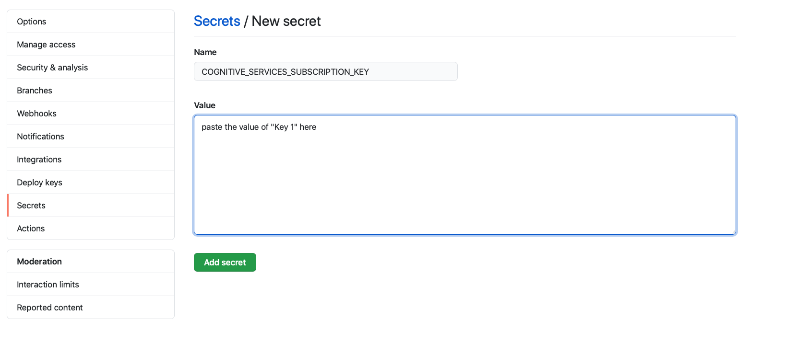

# Rock-Paper-Scissors-Lizard-Spock Browser Demo

## Deploying this project yourself

1. Fork this repository.

2. In your fork, delete the `.github/workflows` folder.

3. You will need an Azure subscription. [Get one here for free](https://azure.com/free/?WT.mc_id=rpsweb-github-davidsmi) if you don't have one already.

4. [Set up an Azure Static Web App resource](https://docs.microsoft.com/en-us/azure/static-web-apps/getting-started?tabs=angular&WT.mc_id=rpsweb-github-davidsmi) in a region of your choice. During the setup process, name your Static Web App `rpsweb` (or something else if you'd like), sign into your Github account, and select this forked repository.

When prompted to enter various application paths in the "Build" setup tab, leave the "App location" and "Api location" fields empty, but enter "app" for the "App artifact location". Note the URL shown after your Static Web App is deployed — this is where your site will eventually be, but nothing will be live there yet.

5. [Create an Azure Speech Service resource key](https://docs.microsoft.com/azure/cognitive-services/speech-service/get-started?WT.mc_id=rpsweb-github-davidsmi) called `rpskey` in the East US region. (You can choose a different region if you wish, but these instructions assume `eastus`.) Feel free to choose the "Free F0" tier unless you expect your website to get lots of usage. (Note that neural text-to-speech is [available in limited regions](https://docs.microsoft.com/azure/cognitive-services/speech-service/regions?WT.mc_id=rpsweb-github-davidsmi#standard-and-neural-voices).)

6. Add two GitHub Secret keys to your repository (Settings -> Secrets). One should be called `COGNITIVE_SERVICES_SUBSCRIPTION_KEY`, and contain "Key 1" from your Azure Cognitive Services subscription keys (viewable in the Azure Portal once you've set up Cognitive Services). The other should be `COGNITIVE_SERVICES_REGION`, and should be set to `eastus` unless you created the key in another region.



7. In the GitHub Action file that Azure Static Web Apps has created for you in your project (`.github/workflows/some-filename.yml`), add the following lines in between the "actions/checkout@v2" and "Build and Deploy" steps/code blocks. You can refer to the [yml file in this repo](https://github.com/lazerwalker/neural-tts-sample/blob/main/.github/workflows/azure-static-web-apps-ashy-desert-0c220ef0f.yml) for a reference.

```
  - name: Inject secret keys
    run: |
      sed -i.bak "s/\$(COGNITIVE_SERVICES_SUBSCRIPTION_KEY)/${{ secrets.COGNITIVE_SERVICES_SUBSCRIPTION_KEY}}/" .env
      sed -i.bak "s/\$(COGNITIVE_SERVICES_REGION)/${{ secrets.COGNITIVE_SERVICES_REGION}}/" .env
```

Once you have committed this change, GitHub Actions will automatically attempt to build your app again. If it succeeds (and it should!) then you should be able to see your app live on the Internet!

If you want to be able to run the app locally, copy the `.env.local.sample` file to `.env.local` and add your keys there as well. Do not commit this file to git. After running `npm install`, you can run a local server to test the app with `npm run dev`.
